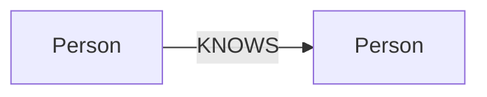

# CognoDB Take-Home Assignment

_Working title — replace with your actual project name once the use case is chosen._

## Use case & "Why a graph database?"

> TODO: Describe the real-world problem this app solves, and explain what a graph
> model (nodes, relationships, multi-hop traversals) gains here over a relational
> schema — e.g. queries that would require several JOINs or recursive CTEs in SQL
> become simple, fast pattern matches in Cypher.

## Data model

> TODO: Add a diagram (e.g. a Mermaid graph or an image) showing labeled node types,
> relationship types, and key properties.



## Tech stack

- **Framework:** Next.js (App Router, TypeScript, Tailwind CSS)
- **Database:** [CognoDB](https://console.cognodb.com) — managed graph database, speaks
  openCypher over Bolt, accessed via the official `neo4j-driver` package.

## Project structure

```
app/            Next.js routes (pages + API routes)
api/health/   Health-check endpoint that verifies DB connectivity
lib/neo4j.ts    Neo4j driver singleton + parameterised query helper
scripts/seed.mjs  Seed script that loads sample data into CognoDB
.env.example    Template for required environment variables (copy to .env)
```

## Setup

### 1. Create your CognoDB instance

1. Sign up at [console.cognodb.com/signup](https://console.cognodb.com/signup) (free tier, no credit card).
2. Create a free `c0` instance and pick a region (provisions in under a minute).
3. Save the connection URI (`bolt+s://<instance-id>.databases.cognodb.cloud`) and the
   generated password for the `cognodb` user — it's shown only once.

### 2. Configure environment variables

```bash
cp .env.example .env
```

Fill in `.env` with your CognoDB URI and password. **Never commit this file.**

### 3. Install dependencies

```bash
npm install
```

### 4. Seed the database

```bash
npm run seed
```

### 5. Run the app

```bash
npm run dev
```

Visit [http://localhost:3000](http://localhost:3000). Check `/api/health` to confirm
the app can reach CognoDB.

## Main queries

> TODO: List and explain the main Cypher queries once implemented, including the
> multi-hop traversal and the query that would be awkward in a relational database.

## Screenshots

> TODO: Add UI screenshots here.

## Deployment

> TODO: Add the hosted demo link and deployment notes (e.g. Vercel), and remember to
> set the same environment variables in the hosting provider's dashboard.
