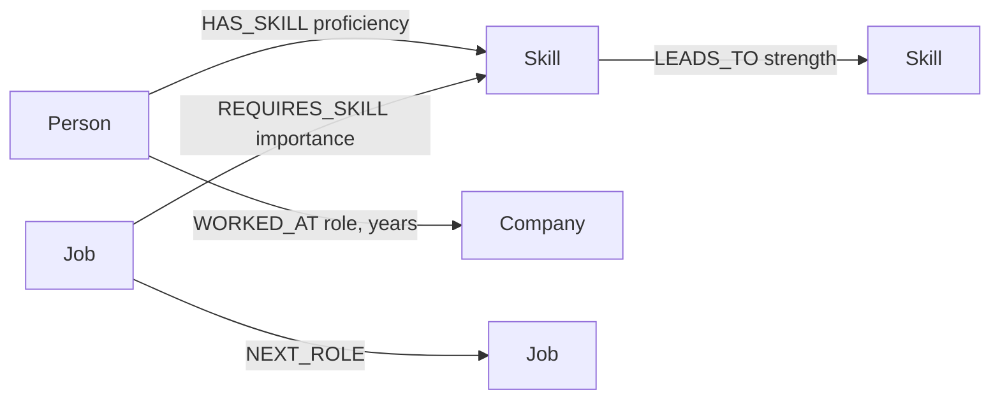

# Skill & Career Path Navigator

A graph-backed app for exploring how skills, jobs and people connect: what
skills a target role requires, what career path leads there, and who else
has a similar skill profile.

## Use case & "Why a graph database?"

Career growth is fundamentally a *connections* problem — which skills unlock
which roles, which roles typically lead to which other roles, and who else
in the network has an overlapping skill set. In a relational schema these
questions require several self-joins or recursive CTEs (e.g. "find every
path of next-roles from my current job to a target job" or "find people two
skill-hops away who share 3+ skills with me"). In Cypher, both are simple,
readable, variable-length pattern matches (`(:Job)-[:NEXT_ROLE*1..4]->(:Job)`),
and they stay fast as the graph grows because traversal cost depends on the
number of relationships touched, not full-table scans.

## Data model



**Nodes:** `Person {name, currentTitle}`, `Skill {name, category}`,
`Job {title, level}`, `Company {name, industry}`

**Relationships:**
- `(Person)-[:HAS_SKILL {proficiency}]->(Skill)`
- `(Job)-[:REQUIRES_SKILL {importance}]->(Skill)`
- `(Person)-[:WORKED_AT {role, years}]->(Company)`
- `(Skill)-[:LEADS_TO {strength}]->(Skill)` — natural "what to learn next" progression
- `(Job)-[:NEXT_ROLE]->(Job)` — typical career-ladder step

Seed data lives in `scripts/data.mjs` (24 skills, 13 jobs, 8 companies, 16 people).

## Tech stack

- **Framework:** Next.js (App Router, TypeScript, Tailwind CSS)
- **Database:** [CognoDB](https://console.cognodb.com) — managed graph database, speaks
  openCypher over Bolt, accessed via the official `neo4j-driver` package.

## Project structure

```
app/            Next.js routes (pages + API routes)
api/health/   Health-check endpoint that verifies DB connectivity
lib/neo4j.ts    Neo4j driver singleton + parameterised query helper
scripts/seed.mjs  Seed script that loads sample data into CognoDB
.env.example    Template for required environment variables (copy to .env)
```

## Setup

### 1. Create your CognoDB instance

1. Sign up at [console.cognodb.com/signup](https://console.cognodb.com/signup) (free tier, no credit card).
2. Create a free `c0` instance and pick a region (provisions in under a minute).
3. Save the connection URI (`bolt+s://<instance-id>.databases.cognodb.cloud`) and the
   generated password for the `cognodb` user — it's shown only once.

### 2. Configure environment variables

```bash
cp .env.example .env
```

Fill in `.env` with your CognoDB URI and password. **Never commit this file.**

### 3. Install dependencies

```bash
npm install
```

### 4. Seed the database

```bash
npm run seed
```

This clears any existing data in the instance and loads the Skill & Career Path
Navigator dataset (skills, jobs, companies, people) from `scripts/data.mjs`.
Safe to re-run any time.

### 5. Run the app

```bash
npm run dev
```

Visit [http://localhost:3000](http://localhost:3000). Check `/api/health` to confirm
the app can reach CognoDB.

## Main queries

> TODO: List and explain the main Cypher queries once implemented, including the
> multi-hop traversal and the query that would be awkward in a relational database.

## Screenshots

> TODO: Add UI screenshots here.

## Deployment

> TODO: Add the hosted demo link and deployment notes (e.g. Vercel), and remember to
> set the same environment variables in the hosting provider's dashboard.
