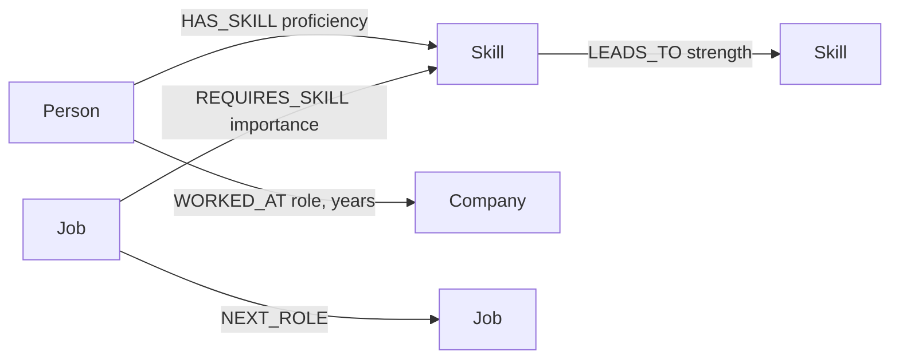
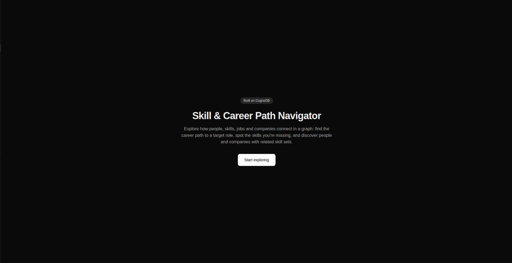
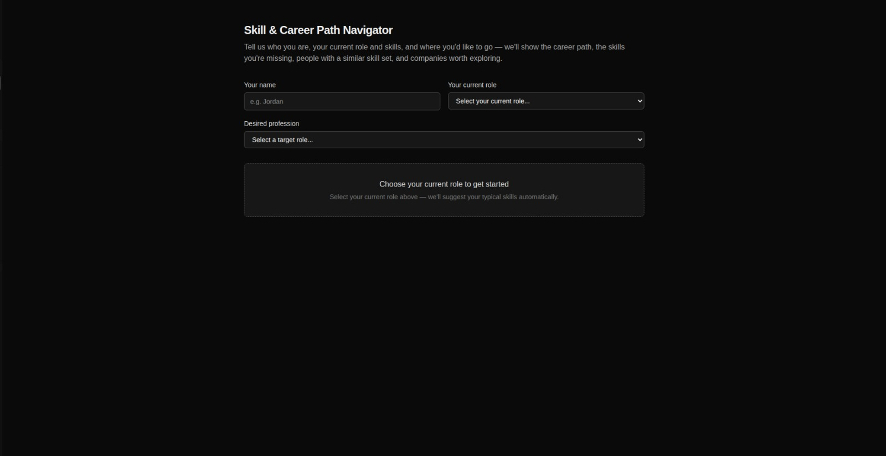
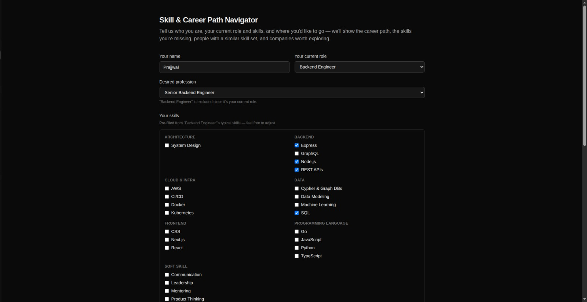
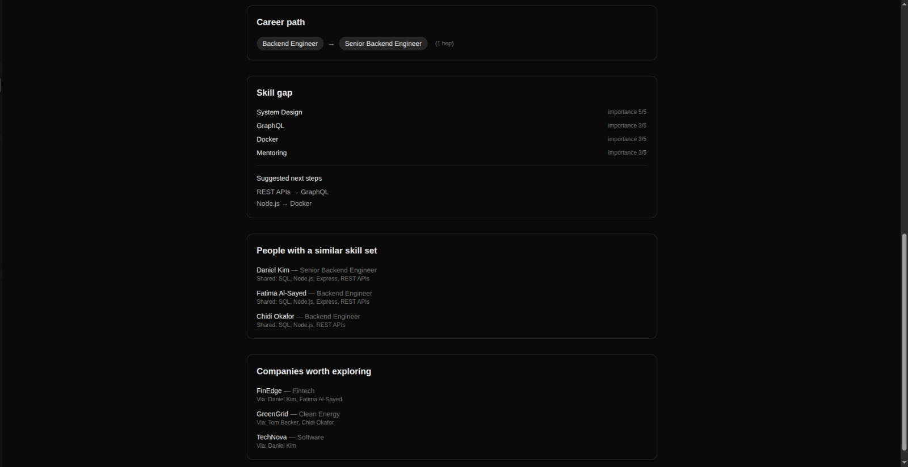

# Skill & Career Path Navigator

A graph-backed app for exploring how skills, jobs and people connect: what
skills a target role requires, what career path leads there, and who else
has a similar skill profile.

## Use case & "Why a graph database?"

Career growth is fundamentally a *connections* problem — which skills unlock
which roles, which roles typically lead to which other roles, and who else
in the network has an overlapping skill set. In a relational schema these
questions require several self-joins or recursive CTEs (e.g. "find every
path of next-roles from my current job to a target job" or "find people two
skill-hops away who share 3+ skills with me"). In Cypher, both are simple,
readable, variable-length pattern matches (`(:Job)-[:NEXT_ROLE*1..4]->(:Job)`),
and they stay fast as the graph grows because traversal cost depends on the
number of relationships touched, not full-table scans.

## Data model



**Nodes:** `Person {name, currentTitle}`, `Skill {name, category}`,
`Job {title, level}`, `Company {name, industry}`

**Relationships:**
- `(Person)-[:HAS_SKILL {proficiency}]->(Skill)`
- `(Job)-[:REQUIRES_SKILL {importance}]->(Skill)`
- `(Person)-[:WORKED_AT {role, years}]->(Company)`
- `(Skill)-[:LEADS_TO {strength}]->(Skill)` — natural "what to learn next" progression
- `(Job)-[:NEXT_ROLE]->(Job)` — typical career-ladder step

Seed data lives in `scripts/data.mjs` (24 skills, 13 jobs, 8 companies, 16 people).

## Tech stack

- **Framework:** Next.js (App Router, TypeScript, Tailwind CSS)
- **Database:** [CognoDB](https://console.cognodb.com) — managed graph database, speaks
  openCypher over Bolt, accessed via the official `neo4j-driver` package.

## Project structure

```
app/            Next.js routes (pages + API routes)
  api/health/   Health-check endpoint that verifies DB connectivity
  api/people/   Lists seeded people (used by similar-people/company results)
  api/jobs/     Lists jobs, used to populate role dropdowns
  api/skills/   Lists skills, used to populate the skill checklist
  api/career-path/            Multi-hop NEXT_ROLE traversal
  api/skill-gap/              Missing skills + learning suggestions
  api/similar-people/         Shared-skill people search
  api/company-recommendations/ Company recommendations via "skill twins"
  explore/      The main interactive UI page
lib/neo4j.ts    Neo4j driver singleton + parameterised query helper
lib/queries.ts  All Cypher queries, one function per query
lib/api-helpers.ts  Shared error-handling + query-param parsing for routes
scripts/data.mjs  Seed dataset (skills, jobs, companies, people)
scripts/seed.mjs  Seed script that loads scripts/data.mjs into CognoDB
.env.example    Template for required environment variables (copy to .env)
```

### How a visitor's profile works

The app doesn't require you to be one of the seeded people. On `/explore` you
enter your name (display only), pick your current role and adjust your
skills (pre-filled from that role's typical requirements), and pick a target
role. That profile is **never written to CognoDB** — it's passed straight
into the Cypher queries as parameters, and matched against the seeded
`Job`/`Skill`/`Person`/`Company` graph in read-only queries.

## Setup

### 1. Create your CognoDB instance

1. Sign up at [console.cognodb.com/signup](https://console.cognodb.com/signup) (free tier, no credit card).
2. Create a free `c0` instance and pick a region (provisions in under a minute).
3. Save the connection URI (`bolt+s://<instance-id>.databases.cognodb.cloud`) and the
   generated password for the `cognodb` user — it's shown only once.

### 2. Configure environment variables

```bash
cp .env.example .env
```

Fill in `.env` with your CognoDB URI and password. **Never commit this file.**

### 3. Install dependencies

```bash
npm install
```

### 4. Seed the database

```bash
npm run seed
```

This clears any existing data in the instance and loads the Skill & Career Path
Navigator dataset (skills, jobs, companies, people) from `scripts/data.mjs`.
Safe to re-run any time.

### 5. Run the app

```bash
npm run dev
```

Visit [http://localhost:3000](http://localhost:3000). Check `/api/health` to confirm
the app can reach CognoDB.

## Main queries

All queries live in `lib/queries.ts` and are called with the official
`neo4j-driver`'s parameterised `session.run(cypher, params)` — never
string-concatenated.

### 1. Career path (multi-hop traversal, 2+ hops)

```cypher
MATCH (start:Job {title: $currentTitle})
MATCH (target:Job {title: $targetJobTitle})
MATCH path = shortestPath((start)-[:NEXT_ROLE*1..6]->(target))
RETURN [n IN nodes(path) | n.title] AS titles,
       [n IN nodes(path) | n.level] AS levels
```
Finds the shortest chain of `NEXT_ROLE` steps from your current job to your
target job (e.g. *Junior Backend Engineer → Backend Engineer → Senior Backend
Engineer → Staff Engineer*). Variable-length path matching like this needs a
recursive CTE with a stop condition in SQL; in Cypher it's one pattern.

### 2. Skill gap + learning suggestions

```cypher
MATCH (j:Job {title: $targetJobTitle})-[r:REQUIRES_SKILL]->(s:Skill)
WHERE NOT s.name IN $skills
RETURN s.name AS name, r.importance AS importance
ORDER BY r.importance DESC
```
plus a second query that walks `LEADS_TO` from skills you already have into
missing skills, to suggest what to learn next. Reused cleverly on the
frontend: calling it with an empty `skills` list returns *all* of a role's
required skills, which is how the skill checklist gets pre-filled.

### 3. People with a similar skill set

```cypher
MATCH (s:Skill)<-[:HAS_SKILL]-(other:Person)
WHERE s.name IN $skills
WITH other, collect(DISTINCT s.name) AS sharedSkills
WHERE size(sharedSkills) >= $minShared
RETURN other.name AS name, other.currentTitle AS currentTitle,
       size(sharedSkills) AS sharedSkillCount, sharedSkills
ORDER BY sharedSkillCount DESC
```
Finds seeded people sharing 3+ skills with your chosen skill list. In SQL
this is a self-join on a `person_skills` table plus a `GROUP BY`/`HAVING` —
here it's a single pattern with aggregation.

### 4. Company recommendations (the relational-awkward one)

```cypher
MATCH (s:Skill)<-[:HAS_SKILL]-(twin:Person)
WHERE s.name IN $skills
WITH twin, count(DISTINCT s) AS shared
WHERE shared >= $minShared
MATCH (twin)-[:WORKED_AT]->(c:Company)
RETURN c.name AS company, c.industry AS industry,
       collect(DISTINCT twin.name) AS connectedVia
ORDER BY size(connectedVia) DESC
```
A 3-hop "friend-of-friend through skills through people through companies"
pattern: find companies where a "skill twin" (someone sharing 2+ skills)
works. In a relational schema this needs nested self-joins across
person/skill and person/company junction tables — in Cypher it's a
two-line traversal.

## Screenshots

**Landing page**


**Explore page — building your profile**


**Entering your name, current role and skills**


**Career path, skill gap, similar people & company recommendations**


## Deployment

**Live demo:** https://cognodb-assignment-6nft.vercel.app/

Deployed on [Vercel](https://vercel.com)'s free tier. To redeploy your own
copy:

1. Import this GitHub repo into Vercel (auto-detected as Next.js).
2. In Project Settings → Environment Variables, add `COGNODB_URI`,
   `COGNODB_USER`, and `COGNODB_PASSWORD` for the Production environment
   (same values as your local `.env`).
3. Deploy, then confirm `/api/health` returns `{"connected": true}`.
